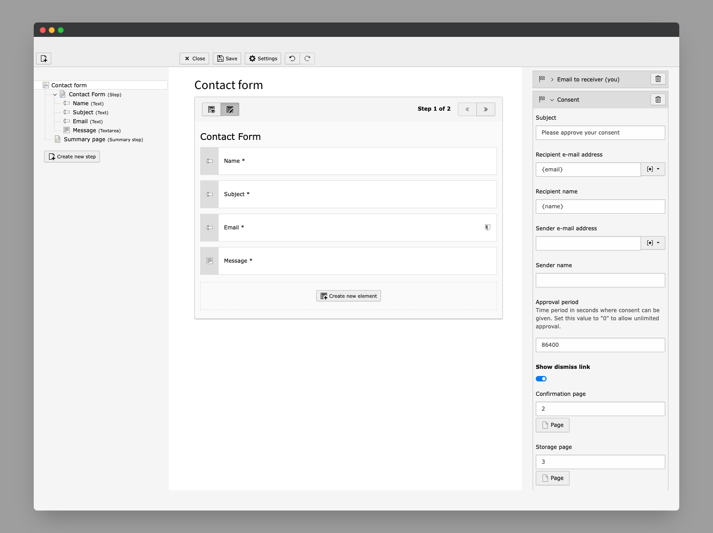

..  include:: /Includes.rst.txt

..  _consent-finisher:

================
Consent finisher
================

A new finisher :php:`Consent` is available in the backend form editor.
It saves all submitted form data in the database and sends a
corresponding mail to either approve or dismiss a given consent.

..  tip::

    The last inserted consent is populated with the finisher variable
    provider. It can be accessed as :yaml:`{Consent.lastInsertedConsent}` in
    the :file:`.form.yaml` configuration.

..  _consent-finisher-example:

Example
=======

..  code-block:: yaml

    finishers:
      -
        identifier: Consent
        options:
          subject: 'Please approve your subscription'
          recipientAddress: '{email}'
          recipientName: '{first-name} {last-name}'
          senderAddress: ''
          senderName: ''
          replyToAddress: ''
          replyToName: ''
          approvalPeriod: '86400'
          showDismissLink: true
          confirmationPid: '277'
          storagePid: '276'
          requireApproveVerification: true
          requireDismissVerification: true
      -
        identifier: SaveToDatabase
        options:
          table: tx_myextension_domain_model_subscription
          mode: insert
          databaseColumnMappings:
            consent:
              # References the consent uid
              value: '{Consent.lastInsertedConsent.uid}'

..  seealso::

    Read more about all available finisher options in :ref:`form-finisher-configuration`.

..  _post-consent-finisher-invocation:

Invoke finishers on consent approval or dismissal
=================================================

After a user has given or revoked consent, it is often necessary to execute
certain form finishers. For example, to send an admin email or redirect to a
specific page.

To achieve this, after the user gives or revokes consent, the originally
completed form is resubmitted. During this resubmission of the form, the
selected finishers can now be overwritten using the :php:`isConsentApproved()`
or :php:`isConsentDismissed()` conditions in a :ref:`form variant <t3form:concepts-variants>`.

..  _post-consent-finisher-invocation-requirements:

Requirements
------------

The following requirements must be met for the form to be resubmitted:

1.  Form variant at the root level of the form must exist
2.  Form variant must redefine the finishers used
3.  Conditions :php:`isConsentApproved()` or :php:`isConsentDismissed()`
    must exist in the variant

..  _post-consent-finisher-invocation-example:

Example
-------

The following form variant is stored directly on the root level of the
form definition (that is, your :file:`.form.yaml` file). It specifies the
form finishers to be executed in case of successful approval by the user.

..  code-block:: yaml
    :emphasize-lines: 4

    variants:
      -
        identifier: post-consent-approval-variant-1
        condition: 'isConsentApproved()'
        finishers:
          -
            identifier: EmailToReceiver
            options:
              # ...
          -
            identifier: Redirect
            options:
              # ...

In this example, an admin email would be sent after the consent has been
given and a redirect to the configured confirmation page would take place.

The same behavior can be achieved in case the user revokes his consent. The
condition :php:`isConsentDismissed()` must then be used instead.
