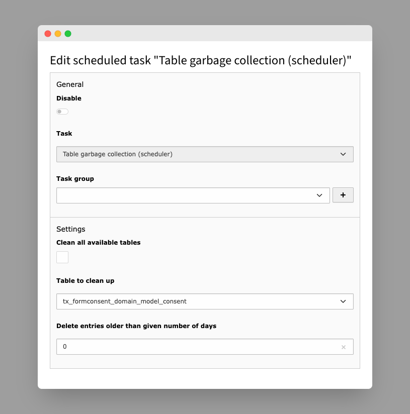

..  include:: /Includes.rst.txt

..  _scheduler-task:

==============
Scheduler task
==============

Consents are considered "expired" if they were originally
submitted with a configured approval period (read more in the
:ref:`consent finisher configuration <form-finisher-configuration>`)
and time between consent submit and allowed approval time has
passed. If consents are expired, they are not deleted by default,
but remain active in the database, even though they can no longer
be approved or dismissed.

For TYPO3 installations having EXT:scheduler installed, this
extension provides a convenient way to remove expired consents.
It adds the consent table `tx_formconsent_domain_model_consent` to
the list of tables for which
:ref:`table garbage collection <t3scheduler:table-garbage-collection-task>`
is supported. For the :php:`expireField` option, the consent field
`valid_until` is configured.

