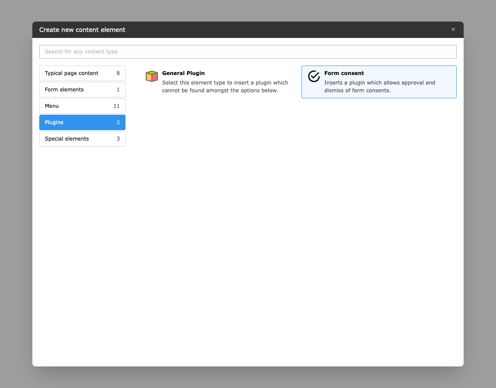

..  include:: /Includes.rst.txt

..  _validation-plugin:

=================
Validation plugin
=================

A plugin is required for approval or dismissal of the consent. The associated page
containing the plugin must then be specified in the
:ref:`finisher configuration <form-finisher-configuration>`.

